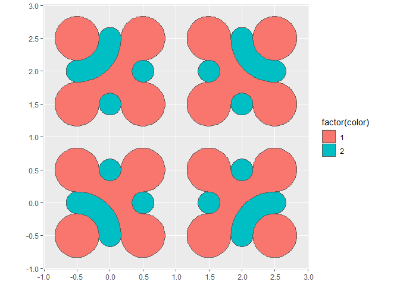
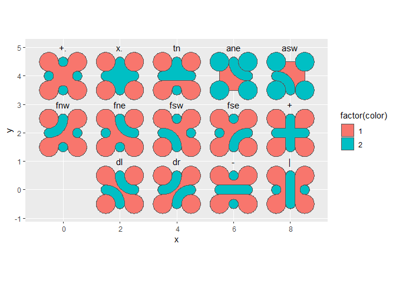

<!-- README.md is generated from README.Rmd. Please edit that file -->

# truchet

<!-- badges: start -->
<!-- badges: end -->

This package implements the multi-scale Truchet tiles of [Christopher
Carlson](https://archive.bridgesmathart.org/2018/bridges2018-39.html) as
explained in this [blog
post](https://christophercarlson.com/portfolio/multi-scale-truchet-patterns/).
This implementation uses the package [{sf}]() to create and manipulate
spatial objects. Two functions are used to create tiles and then to
arrange the tiles in a mosaic. Since the tiles and mosaics are simple
features, they can be plotted using [{ggplot2}]() and `geom_sf()`. In
addition, further manipulations of the tiles (such as buffering) can be
done using the functionality of {sf}.

## Installation

You can install the development version of truchet from
[GitHub](https://github.com/) with:

``` r
# install.packages("devtools")
devtools::install_github("paezha/truchet")
```

## Example

Once installed, the package can be loaded in the usual way:

``` r
library(ggplot2)
library(dplyr)
#> 
#> Attaching package: 'dplyr'
#> The following objects are masked from 'package:stats':
#> 
#>     filter, lag
#> The following objects are masked from 'package:base':
#> 
#>     intersect, setdiff, setequal, union
library(truchet)
```

Currently, these are the tiles that are implemented.

### Tile of type “d” or “\\” and “/” in Carlson’s notation.

Using function `st_truchet_p()` with type “d” produces a data frame with
the elements of two tiles, diagonal left (“\\”) and diagonal right
(“/”). In addition to the geometry of the spatial elements of the tiles,
the data frame includes identifiers for tiles (i.e., tile 1 is “\\” and
tile 2 is “/”) as well as colors.

``` r
st_truchet_p(type = "d") %>%
  ggplot() +
  geom_sf(aes(fill = factor(color))) +
  facet_wrap(~tile)
```


### Tile of type “-” or “-” and “\|” in Carlson’s notation.

Using function `st_truchet_p()` with type “-” produces a data frame with
the elements of two tiles, horizontal (“-”) and vertical (“\|”). In
addition to the geometry of the spatial elements of the tiles, the data
frame includes identifiers for tiles (i.e., tile 1 is “\|” and tile 2 is
“-”) as well as colors.

``` r
st_truchet_p(type = "-") %>%
  ggplot() +
  geom_sf(aes(fill = factor(color))) +
  facet_wrap(~tile)
```


### Tile of type “f” in Carlson’s notation.

Using function `st_truchet_p()` with type “f” produces a data frame with
the elements of four tiles, corresponding to “fne” (tile 1), “fsw” (tile
2), “fse” (tile 3) and “fnw” (tile 4) in Carlson’s notation. In addition
to the geometry of the spatial elements of the tiles, the data frame
includes identifiers for tiles and colors.

``` r
st_truchet_p(type = "f") %>%
  ggplot() +
  geom_sf(aes(fill = factor(color))) +
  facet_wrap(~tile)
```


## Scale of tiles

Carlson’s tiles are designed to work at multiple scales. At the moment,
the function to create tiles supports scale 1 (the tiles are squares
with sides of length 1) and scale 1/2 (sides of tile are of length 1/2).
Argument `scale_p` can be used to select the scale of the tiles (the
default is 1). Notice that the colors alternate at each scale.

``` r
st_truchet_p(type = "d", scale_p = 1/2) %>%
  ggplot() +
  geom_sf(aes(fill = factor(color))) +
  facet_wrap(~tile)
```


## Assembling a mosaic

The tiles can be used as inputs to create mosaics using function
`st_truchet_ms()`

This example shows a single tile:

``` r
tiles_1 <- st_truchet_p(type = "d")
summary(tiles_1)
#>      color            tile             geometry
#>  Min.   :1.000   Min.   :1.0   MULTIPOLYGON:2  
#>  1st Qu.:1.250   1st Qu.:1.0   POLYGON     :4  
#>  Median :2.000   Median :1.5   epsg:NA     :0  
#>  Mean   :1.667   Mean   :1.5                   
#>  3rd Qu.:2.000   3rd Qu.:2.0                   
#>  Max.   :2.000   Max.   :2.0
```

This type of tile produces two distinct tiles. Use only 1 type to create
a mosaic:

``` r
mosaic <- st_truchet_ms(tiles_1 %>% 
                          filter(tile == 1))
```

Retrieve the “container” for the mosaic and the mosaic:

``` r
container <- mosaic[["container"]]
mosaic <- mosaic[["mosaic"]]
```

Plot:

``` r
ggplot() +
  geom_sf(data = mosaic,
          aes(fill = factor(color)),
          color = NA)
```



Use the two tiles of this type

``` r
mosaic <- st_truchet_ms(tiles_1)

container <- mosaic[["container"]]
mosaic <- mosaic[["mosaic"]]

ggplot() +
  geom_sf(data = mosaic,
          aes(fill = factor(color)),
          color = NA)
```


## Combining tile types

Various tile types can be combined:

``` r
tiles_1 <- rbind(st_truchet_p(type = "d"),
                 st_truchet_p(type = "-") %>%
                   mutate(tile = tile + 2))
```

Note that the identifier for the tile needs to be updated for the second
set of tiles, so that the mosaic assembler knows all the different types
of tiles provided. Create a mosaic and plot:

``` r
mosaic <- st_truchet_ms(tiles_1)

container <- mosaic[["container"]]
mosaic <- mosaic[["mosaic"]]

ggplot() +
  geom_sf(data = mosaic,
          aes(fill = factor(color)),
          color = NA)
```


## Combining tiles of different scales

Tiles of different scales can be combined in a single mosaic:

``` r
tiles_1 <- st_truchet_p(type = "f")
tiles_2 <- st_truchet_p(type = "f", scale_p = 1/2)
```

The tiles are placed on a regular grid with spacing 1-by-1. When tiles
at scale 1/2 are used instead of 1 tile four of them are used to cover
the unit square. The parameter `prop` controls the proportion of spots
in the grid are used for tiles at scale 1 (the default is 0.5):

``` r
mosaic <- st_truchet_ms(tiles_1, tiles_2)

container <- mosaic[["container"]]
mosaic <- mosaic[["mosaic"]]

ggplot() +
  geom_sf(data = mosaic,
          aes(fill = factor(color)),
          color = NA)
```



In this next plot the proportion of tiles at scale 1 is increased:

``` r
mosaic <- st_truchet_ms(tiles_1, tiles_2, prop = 0.85)

container <- mosaic[["container"]]
mosaic <- mosaic[["mosaic"]]

ggplot() +
  geom_sf(data = mosaic,
          aes(fill = factor(color)),
          color = NA)
```


And decreased:

``` r
mosaic <- st_truchet_ms(tiles_1, tiles_2, prop = 0.25)

container <- mosaic[["container"]]
mosaic <- mosaic[["mosaic"]]

ggplot() +
  geom_sf(data = mosaic,
          aes(fill = factor(color)),
          color = NA)
```


