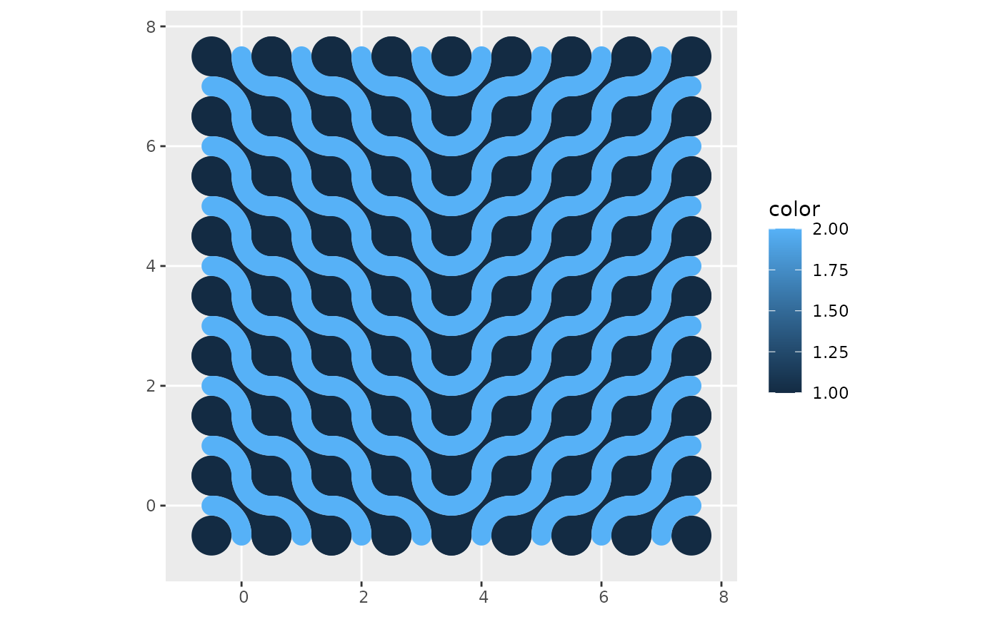
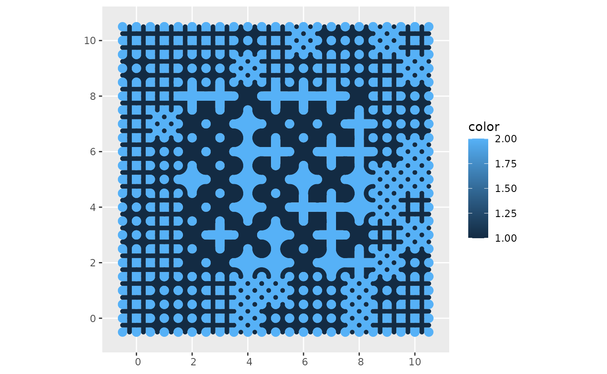

# Designing mosaics

``` r

library(dplyr)
#> 
#> Attaching package: 'dplyr'
#> The following objects are masked from 'package:stats':
#> 
#>     filter, lag
#> The following objects are masked from 'package:base':
#> 
#>     intersect, setdiff, setequal, union
library(ggplot2)
library(truchet)
```

The function
[`st_truchet_ms()`](https://paezha.github.io/truchet/reference/st_truchet_ms.md)
allows the quick creation of mosaics randomizing the type of tiles,
scales, and placement as per the inputs. For greater control of the
assembly of the mosaic, it is also possible to use a data frame as an
input (i.e., a “container”) with parameters coded by location.

To illustrate this, here we create a data frame to serve as a container.
Functions like
[`case_when()`](https://dplyr.tidyverse.org/reference/case-and-replace-when.html)
of [`ifelse()`](https://rdrr.io/r/base/ifelse.html) can be useful to
control what goes where:

``` r

xlim <- c(0, 7)
ylim <- c(0, 7)

# Create a data frame with the spots for tiles
container <- expand.grid(x = seq(xlim[1], xlim[2], 1),
                         y = seq(ylim[1], ylim[2], 1)) %>%
  mutate(tiles = case_when(x <= 3 ~ "dl", 
                           x > 3 ~ "dr"),
         scale_p = 1)
```

This data frame needs the following columns `x` and `y` (the coordinates
of the center of tiles of scale 1), `tiles` (a character vector with the
type of tiles), and `scale_p` (the scale of the tiles). The container is
designed to use tiles at scale 1 only, and it will use “dl”-type tiles
when $`x\le 3`$ and “dr”-type tiles when $`x>3`$:

``` r

mosaic <- st_truchet_ms(df = container)
```

Plot the mosaic:

``` r

ggplot() +
  geom_sf(data = mosaic,
          aes(fill = color),
          color = NA)
```



In this example, the mosaic is built with tiles sampled from a list
provided, and smaller tiles are used towards the edges of the mosaic:

``` r

xlim <- c(0, 10)
ylim <- c(0, 10)

# Create a data frame with the spots for tiles
container <- expand.grid(x = seq(xlim[1], xlim[2], 1),
                         y = seq(ylim[1], ylim[2], 1)) %>%
  # Sample from the list of tiles provided
  mutate(tiles = sample(c("+", "+.", "x."), n(), replace = TRUE),
         scale_p = case_when((x < 1 | x > 9) | (y < 1 | y > 9)  ~ 1/2,
                           (x > 1 & x < 9) & (y > 1 & y < 9) ~ 1,
                           TRUE ~ 1/2))
```

Create mosaic using the designed container:

``` r

mosaic <- st_truchet_ms(df = container)
```

Plot mosaic:

``` r

ggplot() +
  geom_sf(data = mosaic,
          aes(fill = color),
          color = NA)
```


