# Figurative mosaics with flexible tiles

Flexible Truchet tiles are a fantastic tool for creating figurative
mosaics. The technique was described by Bosch and Colley in a 2013 paper
in the [Journal of Mathematics and the
Arts](https://doi.org/10.1080/17513472.2013.838830).

This article shows how to use {truchet} to generate figurative mosaics.
In addition to {truchet}, we need
[{dplyr}](https://dplyr.tidyverse.org/index.htm),
[{ggplot2}](https://ggplot2.tidyverse.org/), and
[{imager}](https://dahtah.github.io/imager/imager.html),
[{purrr}](https://purrr.tidyverse.org/), and
[{sf}](https://r-spatial.github.io/sf/):

``` r

library(dplyr)
#> 
#> Attaching package: 'dplyr'
#> The following objects are masked from 'package:stats':
#> 
#>     filter, lag
#> The following objects are masked from 'package:base':
#> 
#>     intersect, setdiff, setequal, union
library(ggplot2)
library(imager)
#> Loading required package: magrittr
#> 
#> Attaching package: 'imager'
#> The following object is masked from 'package:magrittr':
#> 
#>     add
#> The following object is masked from 'package:dplyr':
#> 
#>     where
#> The following objects are masked from 'package:stats':
#> 
#>     convolve, spectrum
#> The following object is masked from 'package:graphics':
#> 
#>     frame
#> The following object is masked from 'package:base':
#> 
#>     save.image
library(purrr)
#> 
#> Attaching package: 'purrr'
#> The following object is masked from 'package:magrittr':
#> 
#>     set_names
library(sf)
#> Linking to GEOS 3.12.1, GDAL 3.8.4, PROJ 9.4.0; sf_use_s2() is TRUE
library(truchet)
```

The basic idea is as follows.

A mosaic can be made of a collection of tiles, possibly in regular
arrangements. Take the four elemental Truchet tiles, so-called tiles A,
B, C, and D:

``` r

# Tiles types
tile_types <- data.frame(type = c("Al", "Bl", "Cl", "Dl")) %>%
  mutate(x = c(1, 2.5, 1, 2.5),
         y = c(2.5, 2.5, 1, 1),
         b = 1/2)

# Elements for assembling the mosaic
x_c <- tile_types$x
y_c <- tile_types$y
type <- as.character(tile_types$type)
b <- tile_types$b

pmap_dfr(list(x_c, y_c, type, b), st_truchet_flex) %>%
  ggplot() + 
  geom_sf(aes(fill = color),
          color = "black",
          size = 2) +
  geom_text(data = tile_types,
            aes(x = x,
                y = y,
                label = c("A", "B", "C", "D")),
            nudge_y = 0.6) + 
  scale_fill_distiller(direction = 1) +
  theme_void() +
  theme(legend.position = "none")
```

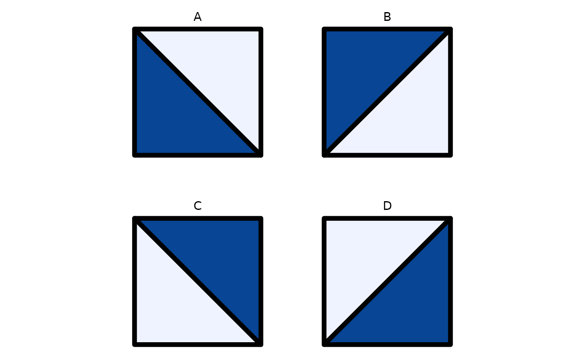

A simple arrangement of a 1 by 1 matrix is just one tile repeated in the
mosaic, for example “A”. This is what Truchet denominated “Design A”:

``` r

# Tiles types
tile_types <- data.frame(type = c("Al", "Al", "Al", "Al")) %>%
  mutate(x = c(1, 2, 1, 2),
         y = c(2, 2, 1, 1),
         b = 1/2)

# Elements for assembling the mosaic
x_c <- tile_types$x
y_c <- tile_types$y
type <- as.character(tile_types$type)
b <- tile_types$b

pmap_dfr(list(x_c, y_c, type, b), st_truchet_flex) %>%
  ggplot() + 
  geom_sf(aes(fill = color),
          color = "black",
          size = 2) +
  geom_text(data = tile_types,
            aes(x = x,
                y = y,
                label = c("Design A", "", "", "")),
            nudge_y = 0.6) + 
  scale_fill_distiller(direction = 1) +
  theme_void() +
  theme(legend.position = "none")
```

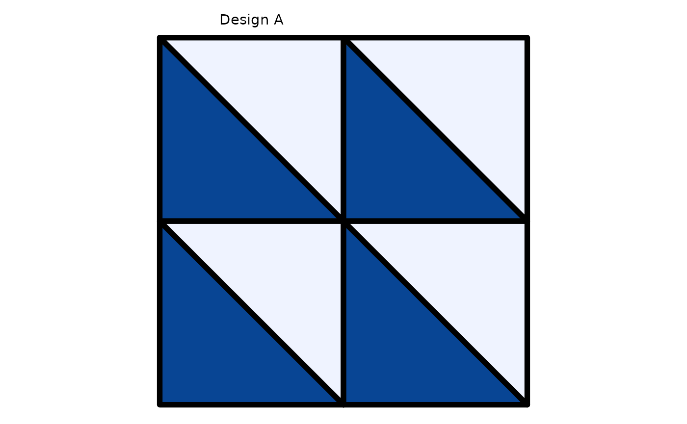

The basic matrix can also be $`2\times 2`$, for example:
``` math
\begin{bmatrix}
A & C\\
C & A
\end{bmatrix}
```
This is Truchet’s Design C:

``` r

# Tiles types
tile_types <- data.frame(type = c("Al", "Cl", "Cl", "Al")) %>%
  mutate(x = c(1, 2, 1, 2),
         y = c(2, 2, 1, 1),
         b = 1/2)

# Elements for assembling the mosaic
x_c <- tile_types$x
y_c <- tile_types$y
type <- as.character(tile_types$type)
b <- tile_types$b

pmap_dfr(list(x_c, y_c, type, b), st_truchet_flex) %>%
  ggplot() + 
  geom_sf(aes(fill = color),
          color = "black",
          size = 2) +
  geom_text(data = tile_types,
            aes(x = x,
                y = y,
                label = c("Design C", "", "", "")),
            nudge_y = 0.6) + 
  scale_fill_distiller(direction = 1) +
  theme_void() +
  theme(legend.position = "none")
```

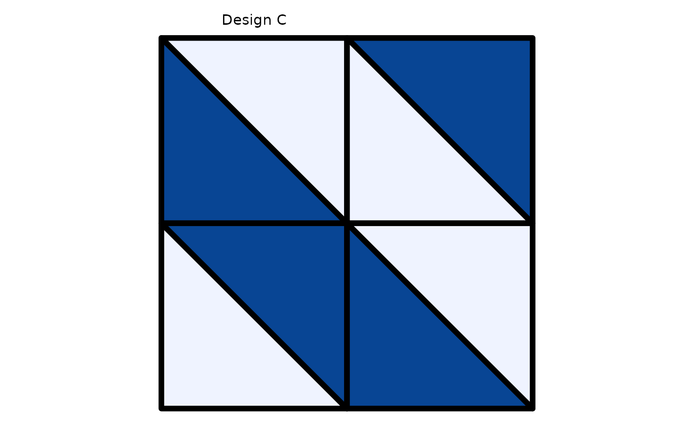

Judicious use of the parameter to control the fold of the boundary of
each tile changes the “darkness” of the tile. For example, this is
Design C with a lighter color (b = 1/3):

``` r

# Tiles types
tile_types <- data.frame(type = c("Al", "Cl", "Cl", "Al")) %>%
  mutate(x = c(1, 2, 1, 2),
         y = c(2, 2, 1, 1),
         b = c(1/3, 1 - 1/3, 1 - 1/3, 1/3))

# Elements for assembling the mosaic
x_c <- tile_types$x
y_c <- tile_types$y
type <- as.character(tile_types$type)
b <- tile_types$b

pmap_dfr(list(x_c, y_c, type, b), st_truchet_flex) %>%
  ggplot() + 
  geom_sf(aes(fill = color),
          color = "black",
          size = 2) +
  geom_text(data = tile_types,
            aes(x = x,
                y = y,
                label = c("Design C with b = 1/3", "", "", "")),
            nudge_y = 0.6) + 
  scale_fill_distiller(direction = 1) +
  theme_void() +
  theme(legend.position = "none")
```

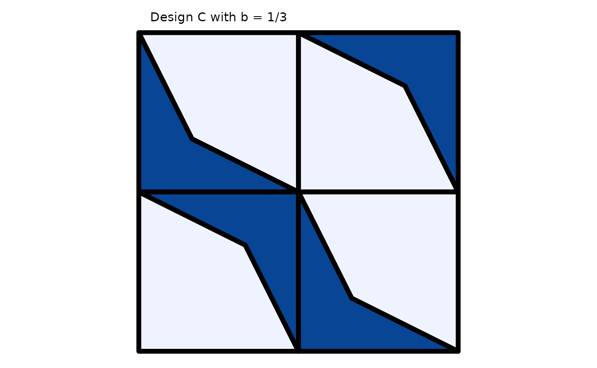

This is Design C with a darker color (b = 2/3):

``` r

# Tiles types
tile_types <- data.frame(type = c("Al", "Cl", "Cl", "Al")) %>%
  mutate(x = c(1, 2, 1, 2),
         y = c(2, 2, 1, 1),
         b = c(2/3, 1 - 2/3, 1 - 2/3, 2/3))

# Elements for assembling the mosaic
x_c <- tile_types$x
y_c <- tile_types$y
type <- as.character(tile_types$type)
b <- tile_types$b

pmap_dfr(list(x_c, y_c, type, b), st_truchet_flex) %>%
  ggplot() + 
  geom_sf(aes(fill = color),
          color = "black",
          size = 2) +
  geom_text(data = tile_types,
            aes(x = x,
                y = y,
                label = c("Design C with b = 1/3", "", "", "")),
            nudge_y = 0.6) + 
  scale_fill_distiller(direction = 1) +
  theme_void() +
  theme(legend.position = "none")
```

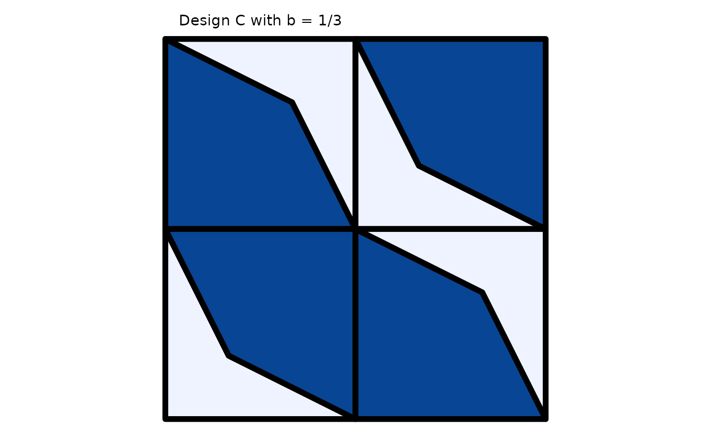

Notice that the parameter alternates between `b` and `1 - b` to ensure
that the four tiles in this $`2\times 2`$ matrix look uniformly darker.
Since `b` takes values between 0 and 1 (it represents a proportion of
the length of the diagonal of the tile), an underlying variable can be
used to modify the “darkness” of the tiles locally. In this way, an
image in grayscale can give those values, as illustrated next.

This example uses an image of Elvis in the jail. Read the image using
[`imager::load.image()`](https://rdrr.io/pkg/imager/man/load.image.html):

``` r

elvis <- imager::load.image(system.file("extdata", 
                                "elvis.jpg", 
                                package = "truchet"))
```

The size of the image is $`1031 \times 1280`$ and has three colour
channels.

``` r

elvis
#> Image. Width: 1031 pix Height: 1280 pix Depth: 1 Colour channels: 3
```

This is Elvis doing the [jailhouse
rock](https://www.youtube.com/watch?v=gj0Rz-uP4Mk):

``` r

plot(elvis)
```

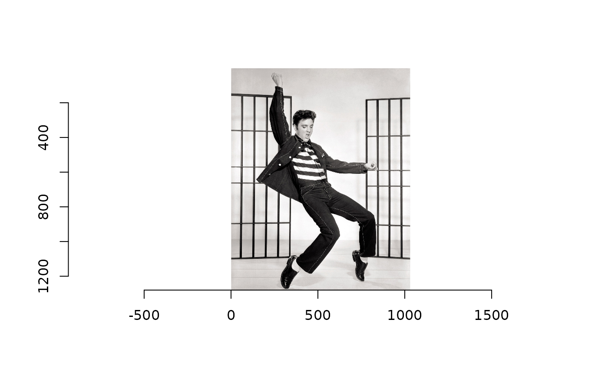

The size of the image means that there are 1.31968^{6} pixels. Creating
an image with all these pixels is very lengthy, and not very interesting
because the high resolution means that the figurative aspect of the
mosaic is lost. Instead of working with the original image, here we
scale it so that its width is 200 pixels:

``` r

elvis_rs <- imresize(elvis, scale = 1/15, interpolation = 6)
```

Now the size of the image is $`61\times 76`$ and consists of only 4636
pixels. Clearly, the resolution is much lower and a lot of detail is
lost, but that is part of the point of doing a figurative mosaic:

``` r

plot(elvis_rs)
```


To use this image we need to change its color map to grayscale and also
to transform from class `cimg`/`imager_array` to data frame:

``` r

elvis_df <- elvis_rs %>%
  grayscale() %>% 
  as.data.frame()
```

This data frame now includes the coordinates of the pixels (but note
that the y axis is reversed due to the convention to index pixels in an
image). In addition, the column `value` gives the shades of gray, with 0
= white and 1 = black:

``` r

summary(elvis_df)
#>        x            y             value         
#>  Min.   : 1   Min.   : 1.00   Min.   :0.002297  
#>  1st Qu.:16   1st Qu.:19.75   1st Qu.:0.557348  
#>  Median :31   Median :38.50   Median :0.807564  
#>  Mean   :31   Mean   :38.50   Mean   :0.682023  
#>  3rd Qu.:46   3rd Qu.:57.25   3rd Qu.:0.888449  
#>  Max.   :61   Max.   :76.00   Max.   :1.000000
```

Now we can use this data frame to design the mosaic. Here we use Design
C. The modulus operation is used to create a checkerboard pattern of
tiles A and C that replicates the matrix $`[A, C; C, A]`$, and also to
adjust parameter `b` when creating the tiles:

``` r

df <- elvis_df %>% 
  # Reverse the y axis
  mutate(y = -(y - max(y)),
         # The modulus of x + y can be used to create a checkerboard pattern
         tiles = case_when((x + y) %% 2 == 0 ~ "Al",
                           (x + y) %% 2 == 1 ~ "Cl"),
         b = case_when((x + y) %% 2 == 0 ~ 1 - value,
                       (x + y) %% 2 == 1 ~ value))
```

Function
[`st_truchet_fm()`](https://paezha.github.io/truchet/reference/st_truchet_fm.md)
is used to create a mosaic of flexible tiles. Column `b` is scaled to
avoid completely white or completely black tiles:

``` r

# Start a timer
start_time <- Sys.time()

# Assemble mosaic
mosaic <- st_truchet_fm(df = df %>% 
                          mutate(b = b * 0.99 + 0.001))

# End timer
end_time <- Sys.time()

# Calculate time
end_time - start_time
#> Time difference of 43.64118 secs
```

It takes two or three minutes to process an image of 61 by 76 pixels.

Since the mosaic is a simple features data frame it can be plotted using
[`geom_sf()`](https://ggplot2.tidyverse.org/reference/ggsf.html) in
{ggplot2}:

``` r

mosaic %>%
  ggplot() + 
  geom_sf(aes(fill = color),
          color = NA) +
  scale_fill_distiller(direction = 1) + 
  coord_sf(expand = FALSE) +
  theme_void() +
  theme(legend.position = "none")
```

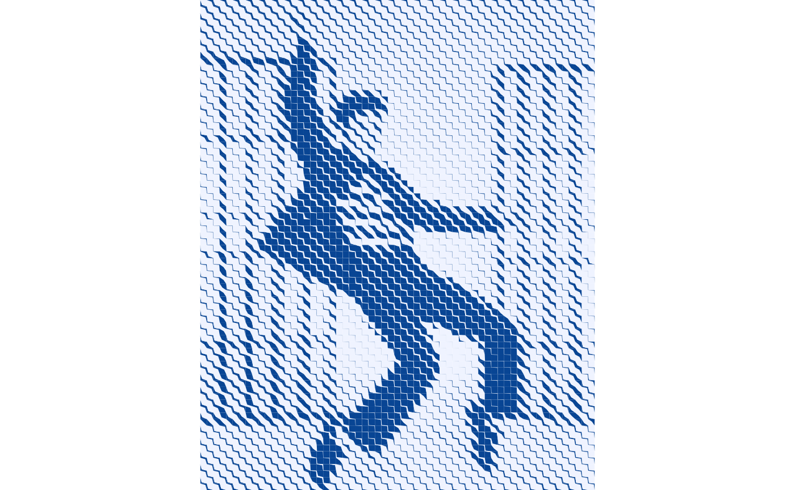

Other designs can be used. Truchet’s Design D results from the following
$`2\times 2`$ matrix:
``` math
\begin{bmatrix}
B & A\\
C & D
\end{bmatrix}
```

This is a windmill-like set of 4 tiles:

``` r

# Tiles types
tile_types <- data.frame(type = c("Bl", "Al", "Cl", "Dl")) %>%
  mutate(x = c(1, 2, 1, 2),
         y = c(2, 2, 1, 1),
         b = 1/2)

# Elements for assembling the mosaic
x_c <- tile_types$x
y_c <- tile_types$y
type <- as.character(tile_types$type)
b <- tile_types$b

pmap_dfr(list(x_c, y_c, type, b), st_truchet_flex) %>%
  ggplot() + 
  geom_sf(aes(fill = color),
          color = "black",
          size = 2) +
  geom_text(data = tile_types,
            aes(x = x,
                y = y,
                label = c("Design D", "", "", "")),
            nudge_y = 0.6) + 
  scale_fill_distiller(direction = 1) +
  theme_void() +
  theme(legend.position = "none")
```

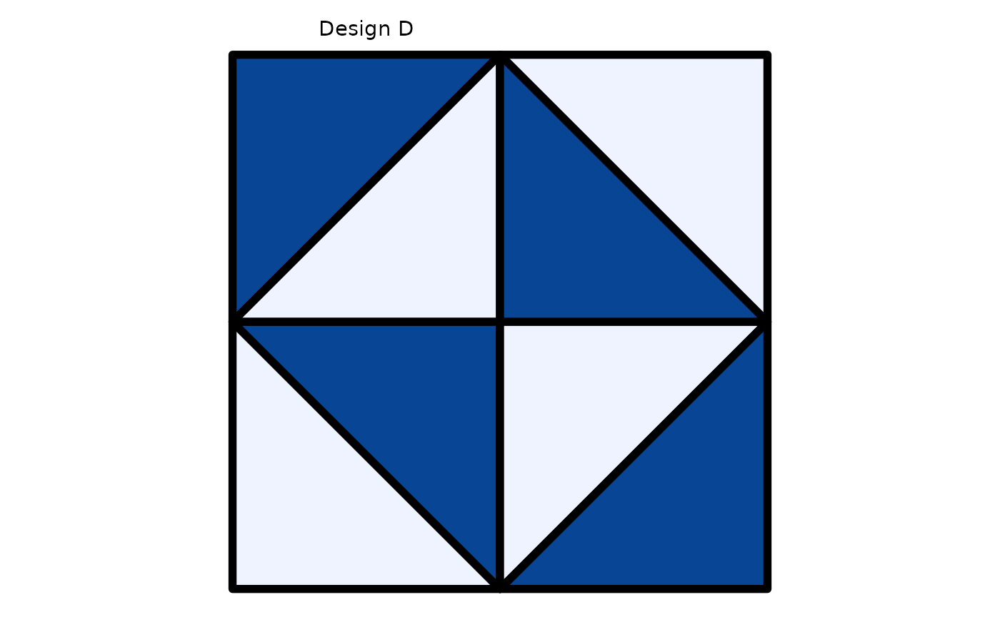

To illustrate this design, we will use the iconic image of [Frida
Kahlo](https://en.wikipedia.org/wiki/Frida_Kahlo):

``` r

frida <- load.image(system.file("extdata", 
                                "frida.jpg", 
                                package = "truchet"))
```

This is the source image:

``` r

plot(frida)
```

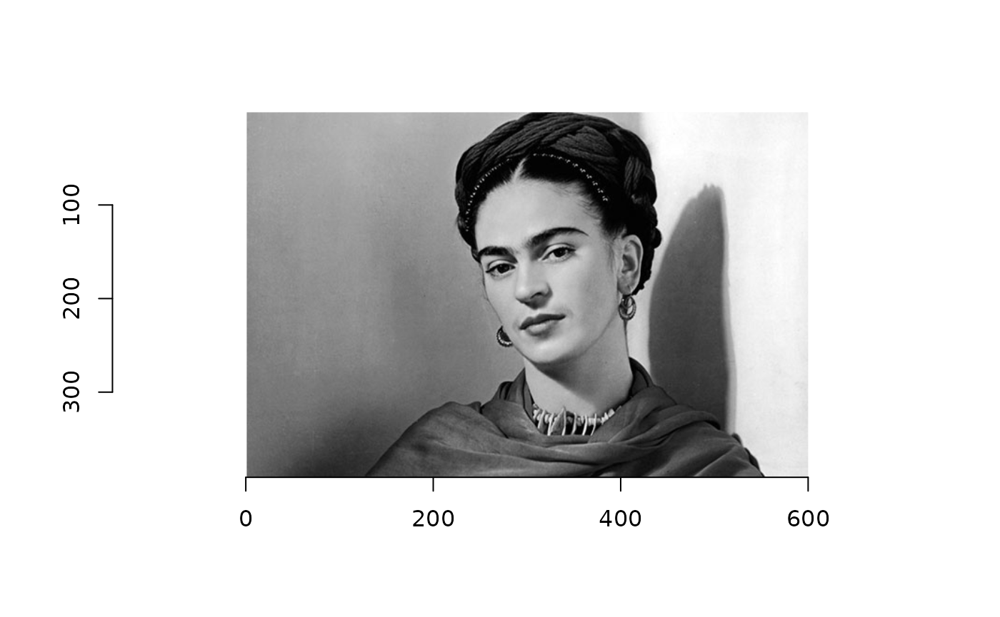

We can select part of the image, for instance to zoom in on the face:

``` r

frida_sel <- imsub(frida,x %inr% c(109,500))
```

The resolution may still be high for the mosaic, so we resize image:

``` r

frida_rs <- imresize(frida_sel, scale = 1/5, interpolation = 6)
```

As before, we convert to grayscale and then to data frame:

``` r

frida_df <- frida_rs %>%
  grayscale() %>% 
  as.data.frame()
```

Creating this design is a little bit trickier. Notice the use of
[`dplyr::case_when()`](https://dplyr.tidyverse.org/reference/case-and-replace-when.html)
and the modulus operation to place the tiles:

``` r

df <- frida_df %>% 
  # Reverse the y axis
  mutate(y = -(y - max(y)),
         # The modulus is used to place the tiles in the desired pattern and using the desired darkness
         tiles = case_when(x %% 2 == 1 & y %% 2 == 0 ~ "Bl",
                           x %% 2 == 0 & y %% 2 == 0 ~ "Al",
                           x %% 2 == 1 & y %% 2 == 1 ~ "Cl",
                           x %% 2 == 0 & y %% 2 == 1 ~ "Dl"),
         b = case_when(x %% 2 == 1 & y %% 2 == 0 ~ 1 - value,
                       x %% 2 == 0 & y %% 2 == 0 ~ 1 - value,
                       x %% 2 == 1 & y %% 2 == 1 ~ value,
                       x %% 2 == 0 & y %% 2 == 1 ~ value))
```

Create mosaic:

``` r

# Start a timer
start_time <- Sys.time()

# Assemble mosaic
mosaic <- st_truchet_fm(df = df %>% mutate(b = b * 0.80 + 0.001))

# End timer
end_time <- Sys.time()

# Calculate time
end_time - start_time
#> Time difference of 58.03661 secs
```

It takes about three minutes to process this mosaic with 6084 tiles.
This is the resulting mosaic:

``` r

mosaic %>%
  ggplot() + 
  geom_sf(aes(fill = color),
          color = NA) +
  scale_fill_distiller(direction = 1) + 
  coord_sf(expand = FALSE) +
  theme_void() +
  theme(legend.position = "none")
```

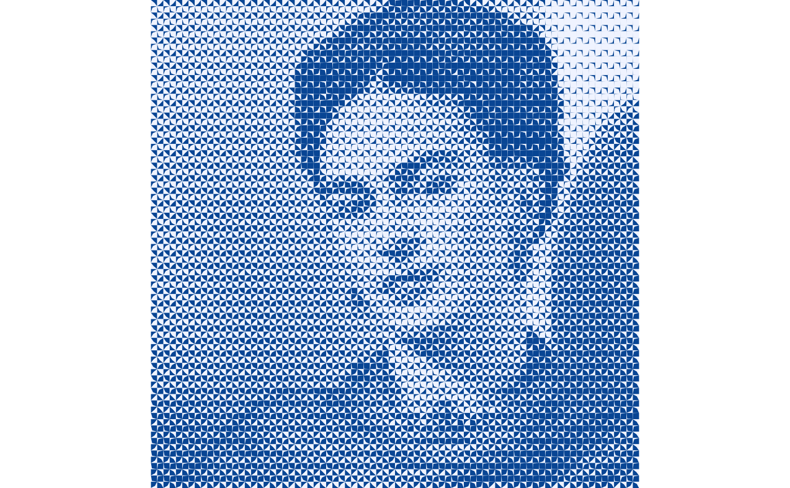

It is possible to randomize the tile allocation. A fascinating aspect of
Truchet tiles is how the “texture” of the mosaic changes with each
variation in the placement of tiles. For example:

``` r

# Set seed
seed <- 1085
set.seed(seed)

# Randomly select tiles
tiles <- sample(c("Al", "Bl", "Cl", "Dl"), size = 4, replace = TRUE)

value <- 3/4
# Design the mosaic
df <- frida_df %>% 
  # Reverse the y axis
  mutate(y = -(y - max(y)),
         tiles = case_when(x %% 2 == 1 & y %% 2 == 0 ~ tiles[1],
                           x %% 2 == 0 & y %% 2 == 0 ~ tiles[2],
                           x %% 2 == 1 & y %% 2 == 1 ~ tiles[3],
                           x %% 2 == 0 & y %% 2 == 1 ~ tiles[4]),
         # Important! Notice the adjustment to the values to ensure that the area correctly reflects the underlying darkness value
         b = case_when(tiles == "Al" ~ 1- value, 
                       tiles == "Bl" ~ 1- value, 
                       tiles == "Cl" ~ value, 
                       tiles == "Dl" ~ value))

# Assemble mosaic
mosaic <- st_truchet_fm(df = df %>% mutate(b = b * 0.99 + 0.001))

# Plot
mosaic %>%
  ggplot() + 
  geom_sf(aes(fill = color),
          color = NA) +
  scale_fill_distiller(direction = 1) + 
  coord_sf(expand = FALSE) +
  theme_void() +
  theme(legend.position = "none")
```

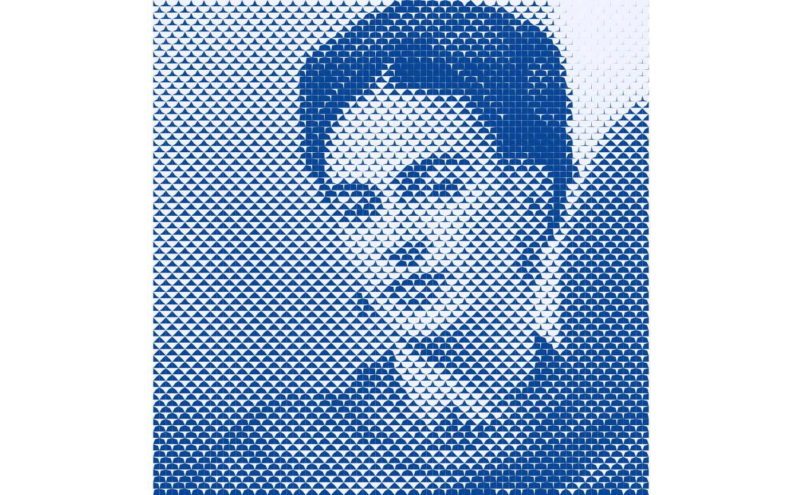

A nice feature of working with tiles as spatial data is that we can
perform geometric operations, such as
[`st_nearest_feature()`](https://r-spatial.github.io/sf/reference/st_nearest_feature.html)
from the {sf} package. The next example illustrate how to “borrow” the
colors of the underlying image.

Load the source image:

``` r

flower <- load.image(system.file("extdata", 
                                 "flower.jpg", 
                                 package = "truchet"))
```

The image is quite colorful:

``` r

plot(flower)
```

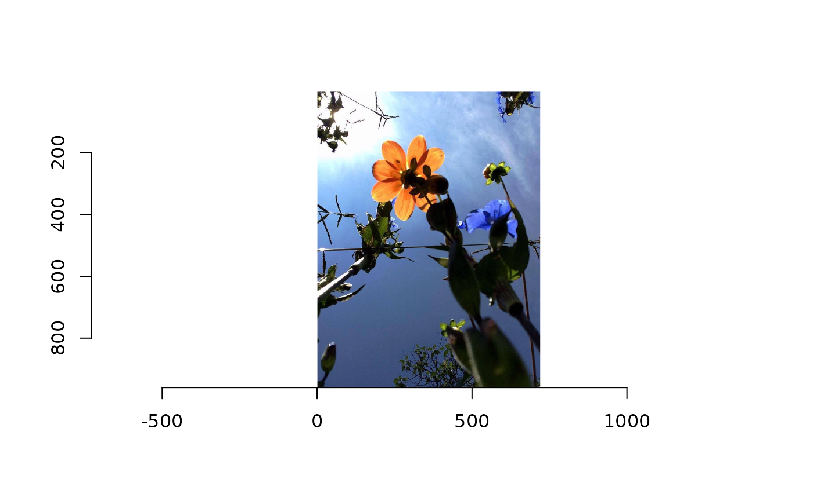

Resize image:

``` r

flower_rs <- imresize(flower, scale = 1/15, interpolation = 6)
```

As before, we convert to grayscale and then to data frame:

``` r

flower_df <- flower_rs %>%
  grayscale() %>% 
  as.data.frame()
```

This time, though, we also convert image to a data frame but retrieve
the colors:

``` r

flower_color_df <- flower_rs %>%
  as.data.frame(wide="c") %>% 
  # Reverse the y axis
  mutate(y = -(y - max(y)),
         hex_color = rgb(c.1,
                         c.2,
                         c.3))
```

Use Design C for the mosaic:

``` r

df <- flower_df %>% 
  # Reverse the y axis
  mutate(y = -(y - max(y)),
         # The modulus of x + y can be used to create a checkerboard pattern
         tiles = case_when((x + y) %% 2 == 0 ~ "Al",
                           (x + y) %% 2 == 1 ~ "Cl"),
         b = case_when((x + y) %% 2 == 0 ~ 1 - value,
                       (x + y) %% 2 == 1 ~ value))

# Assemble the mosaic
mosaic <- st_truchet_fm(df = df %>% mutate(b = b * 0.80 + 0.001))
```

This is the duotone mosaic:

``` r

mosaic %>%
  ggplot() + 
  geom_sf(aes(fill = color),
          color = NA) +
  scale_fill_distiller(direction = 1) + 
  coord_sf(expand = FALSE) +
  theme_void() +
  theme(legend.position = "none")
```

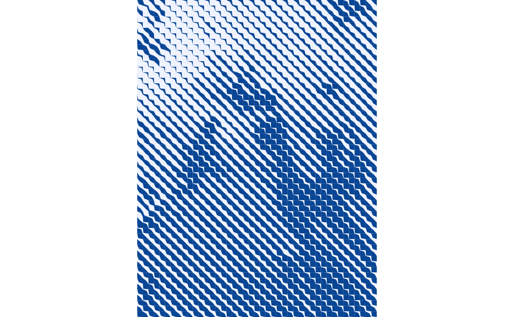

Convert the color data frame to simple features. This way we can use
functions from the {sf} package to find the nearest feature to borrow
the original colors in the image:

``` r

flower_color_sf <- flower_color_df %>%
  st_as_sf(coords = c("x", "y"))
```

Find the nearest feature and borrow color:

``` r

hex_color <- flower_color_sf[mosaic %>% 
                               st_nearest_feature(flower_color_sf),] %>%
  pull(hex_color)
```

We can now add the hexadecimal colors to the data frame with the mosaic:

``` r

mosaic$hex_color <- hex_color
```

To plot the mosaic we use the duotone colors to filter part of the
tiles. For example, here we filter duotone color 2 and use the
hexadecimal colors to fill the polygons:

``` r

mosaic %>%
  filter(color == 2) %>%
  ggplot() + 
  geom_sf(aes(fill = hex_color),
          color = NA) +
  scale_fill_identity() +
  coord_sf(expand = FALSE) +
  theme_void() +
  theme(legend.position = "none")
```

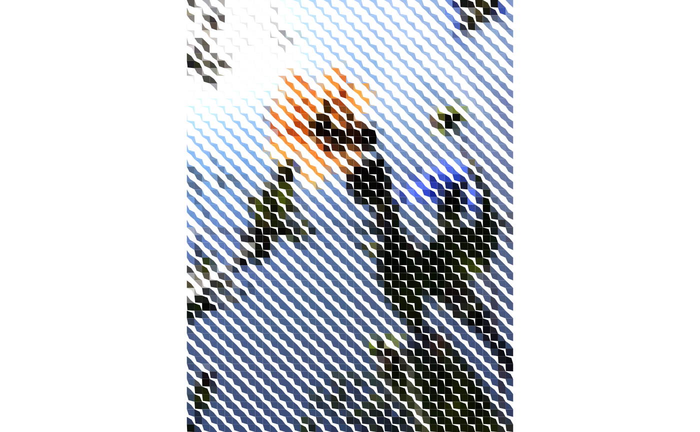

In this one, we filter the tiles with duotone color 1:

``` r

mosaic %>%
  filter(color == 1) %>%
  ggplot() + 
  geom_sf(aes(fill = hex_color),
          color = NA) +
  scale_fill_identity() +
  coord_sf(expand = FALSE) +
  theme_void() +
  theme(legend.position = "none")
```

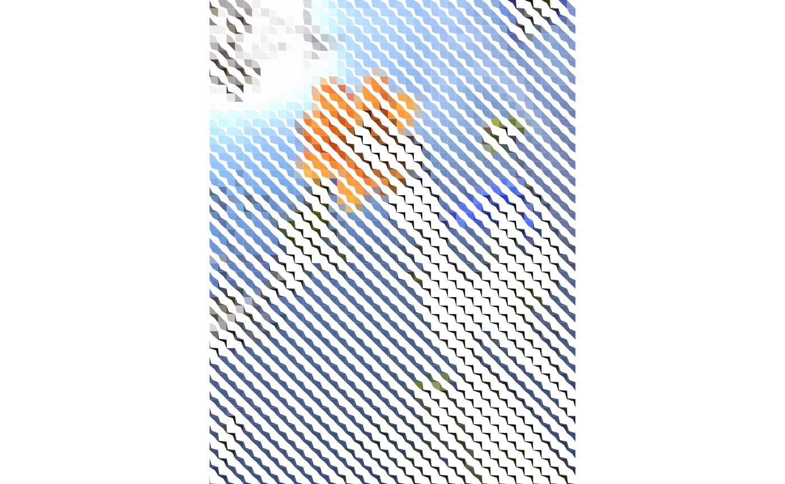

Playing with the background of the image can also lead to interesting
results:

``` r

mosaic %>%
  filter(color == 2) %>%
  ggplot() + 
  geom_sf(aes(fill = hex_color),
          color = NA) +
  scale_fill_identity() +
  coord_sf(expand = FALSE) +
  theme_void() +
  theme(panel.background = element_rect(fill = "black"),
        legend.position = "none")
```

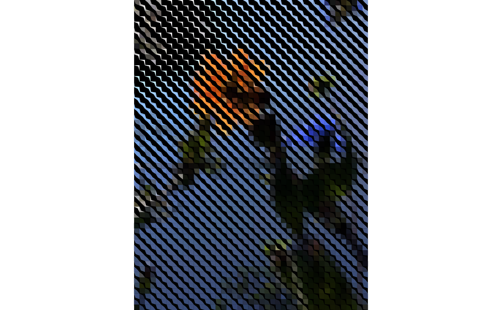
