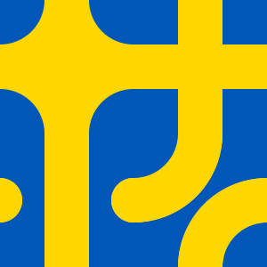

```{r setup, include = FALSE}
knitr::opts_chunk$set(
  collapse = TRUE,
  comment = "#>"
)
```

Truchet tiles, by creating perfectly adaptable interlocking patterns, are great to animate. This tutorial shows how to create an animated mini-mosaic.

The packages used in this article (addition to {truchet}), are [{dplyr}](https://dplyr.tidyverse.org/index.htm), [{gganimate}](https://gganimate.com/articles/gganimate.html), [{ggplot2}](https://ggplot2.tidyverse.org/), [{purrr}](https://purrr.tidyverse.org/), and [{sf}](https://r-spatial.github.io/sf/):
```{r load-libries, message=FALSE}
library(dplyr)
library(gganimate)
library(ggplot2)
library(sf)
library(truchet)
```

Create a function to rotate a tile. Lovelace et al. discuss how to do this with simple feature objects in their wonderful book [Geocomputation with R](https://geocompr.robinlovelace.net/geometric-operations.html#affine-transformations):
```{r function-to-rotate-tiles}
rotation = function(a, x, y, type){
  tile <- st_truchet_p(type = type)
  rm <- matrix(c(cos(a), sin(a), 
                 -sin(a), cos(a)),
               nrow = 2, 
               ncol = 2)
  tile %>%
    mutate(geometry = st_geometry(tile) * rm + c(x, y)) %>%
    st_sf()
} 
```

Create a sequence of angles to rotate the tiles in the animation. The `steps_anim` controls the number of discrete angles for rotating the tile 180 degrees ($\pi$ radians). A large number of steps results in a smoother animation, but this also increases computation time:
```{r sequence-for-rotations}
pause <- 60
steps_anim <- 180

a <- c(seq(0, pi/2, pi/steps_anim), # From zero to pi/2 in `pi/steps_anim` increments, basically a 90 degrees rotation
       rep(pi/2, pause), # Pause at pi/2 for `pause` 
       seq(pi/2, pi, pi/steps_anim), # From pi/2 to pi in `pi/steps_anim` increments, another 90 degrees rotation
       rep(pi, pause), # Pause at pi for `pause` 
       seq(pi, 3 * pi/2, pi/steps_anim), # From pi to 3 * pi/2 in `pi/steps_anim` increments, another 90 degrees rotation
       rep(3 * pi/2, pause), # Pause at 3 * pi/2 for `pause` 
       seq(3 * pi/2, 2 * pi, pi/steps_anim), # From 3 * pi/2 to 2 * pi in `pi/steps_anim` increments, another 90 degrees rotation
       rep(2 * pi, pause)) # Pause at 2 * pi for `pause` 
```

In this example we will create a 2-by-2 mini-mosaic, so we need to select four tiles; here, we randomly sample four styles from all available tiles:
```{r set-seed-and-select-tiles}
# Set seed
set.seed(7336)

tile_type <- sample(c("dl", "dr", "-", "|", "fnw", "fne", "fsw", "fse", "+", "+.", "x.", "tn"),
                    4, 
                    replace = TRUE)
```

We will place the tales in a 2-by-2 arrangement, at locations (1,1), (1,2), (2,2), and (2,1). This is the static mosaic, which we will later use as the background for the animated mosaic:
```{r static-mosaic}
# Create a data frame with the spots for the background tiles
background <- data.frame(x = c(1, 1, 2, 2),
                        y = c(1, 2, 2, 1),
                        tiles = tile_type,
                        scale_p = 1) %>%
  st_truchet_ms()

ggplot() +
  geom_sf(data = background,
          aes(fill = factor(color)),
          color = NA)+
  # Select colors; this is a duotone mosaic
  scale_fill_manual(values = c("1" = "#0057b7", "2" = "#ffd700"))
```

Take the first tile and rotate it according to the sequence of angles defined above. Note that the coordinates of the tile need to be specified, so tile number one will be placed at (1,1). A counter is used to keep track of the discrete rotations; this is used in the animation:
```{r first-animated-tile}
# Tile 1
# Initialize an empty data frame
tile_1 <- data.frame()

# Initialize the counter
count <- 0

for(i in a){
  # Increase the counter by one
  count <- count + 1
  # Bind a rotated tile to the existing data frame
  tile_1 <- rbind(tile_1,
                  data.frame(rotation(a = i, 
                                      # Coordinates of tile
                                      x = 1, 
                                      y = 1, 
                                      type = tile_type[1]), 
                             state = count))
}

# Convert the data frame to simple features and label it as tile 1
tile_1 <- tile_1 %>%
  mutate(tile = "1") %>%
  st_sf()
```

Repeat to create the remaining three tiles:
```{r remaining-animated-tiles}
# Tile 2
tile_2 <- data.frame()
count <- 0

for(i in a){
  count <- count + 1
  tile_2 <- rbind(tile_2,
                  data.frame(rotation(a = i, 
                                      # Coordinates of tile
                                      x = 2, 
                                      y = 2, 
                                      type = tile_type[2]), 
                             state = count))
}

# Convert the data frame to simple features and label it as tile 2
tile_2 <- tile_2 %>%
  mutate(tile = "2") %>%
  st_sf()

# Tile 3
tile_3 <- data.frame()
count <- 0

for(i in a){
  count <- count + 1
  tile_3 <- rbind(tile_3,
                  data.frame(rotation(a = i, 
                                      # Coordinates of tile
                                      x = 1, 
                                      y = 2, 
                                      type = tile_type[3]), 
                             state = count))
}

# Convert the data frame to simple features and label it as tile 3
tile_3 <- tile_3 %>%
  mutate(tile = "3") %>%
  st_sf()

# Tile 4
tile_4 <- data.frame()
count <- 0

for(i in a){
  count <- count + 1
  tile_4 <- rbind(tile_4,
                  data.frame(rotation(a = i, 
                                      # Coordinates of tile
                                      x = 2, 
                                      y = 1, 
                                      type = tile_type[4]), 
                             state = count))
}

# Convert the data frame to simple features and label it as tile 4
tile_4 <- tile_4 %>%
  mutate(tile = "4") %>%
  st_sf()
```

Here we assemble mosaic by binding all the animated tiles:
```{r assemble-animated-mosaic}
mosaic <- rbind(tile_1,
                tile_2,
                tile_3,
                tile_4)
```

When creating the plot, we can limit the extent of the coordinates to "crop" the mosaic to a square. Create plot and render the animation. 
```{r render-plot}
p <- ggplot() +
  # Render the static background mosaic
  geom_sf(data = background,
          aes(fill = factor(color)),
          color = NA) +
  # Render the animated tiles: first the tiles of color 1
  geom_sf(data = mosaic %>%
            filter(color == 1),
          aes(fill = factor(color),
              # It is important to group by `state` and `tile` otherwise the animation gets wacky
              group = interaction(state, tile)),
          color = NA) +
  # Render the animated tiles: then the tiles of color 2
  geom_sf(data = mosaic %>%
            filter(color == 2),
          aes(fill = factor(color),
              # It is important to group by `state` and `tile` otherwise the animation gets wacky
              group = interaction(state, tile)),
          color = NA) +
  # Select colors; this is a duotone mosaic
  scale_fill_manual(values = c("1" = "#0057b7", "2" = "#ffd700")) + 
  # "Crop" the mosaic by limiting the extent of the coordinates
  coord_sf(xlim = c(0.5, 2.5),
           ylim = c(0.5, 2.5),
           expand = FALSE) +
  theme_void() +
  theme(legend.position = "none") +
  # This is what makes things move
  gganimate::transition_time(state)
```

Finally render the animation with desired parameters:
```{r animate-plot, include = FALSE, eval = FALSE}
gganimate::animate(p, 
        rewind = FALSE,
        end_pause = 10,
        fps = 60,
        duration = 10,
        res = 300,
        height = 1.0, 
        width = 1.0,
        units = "in")

anim_save("animated-mosaic-7336.gif")
```

```
gganimate::animate(p, 
        rewind = FALSE,
        end_pause = 10,
        fps = 60,
        duration = 10,
        res = 300,
        height = 1.0, 
        width = 1.0,
        units = "in")
```




